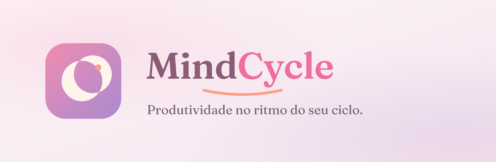
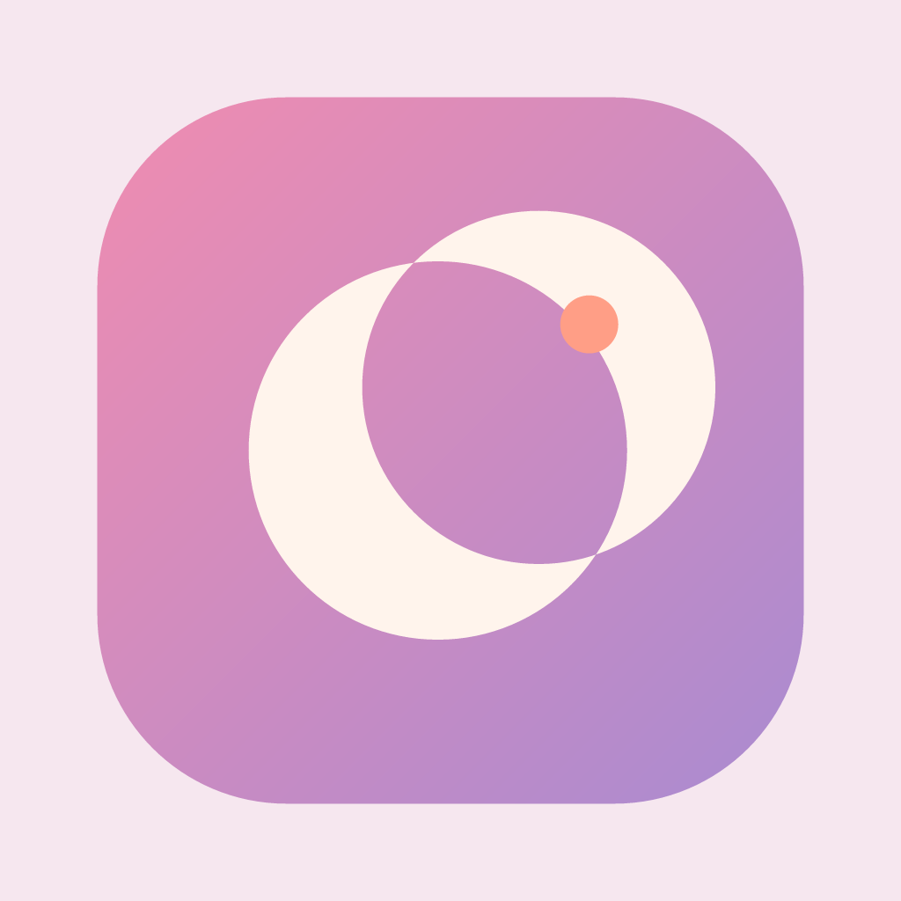

<picture>
  <source media="(prefers-color-scheme: dark)" srcset="assets/brand/banner/readme-banner-dark.png">
  
</picture>

<h3 align="center">📄 <a href="https://mdsreq-fga-unb.github.io/REQ-2026.2-T02-MindCycle/">Documentação do produto e do projeto</a></h3>

  Requisitos de Software · 2026.2 · Turma 02 · FCTE/UnB 
  Cliente: Laboratório de Competência em Software Livre (LabLivre)

---

## Sobre o projeto

Ferramentas de produtividade tratam todos os dias como iguais. Para mulheres que atuam ou
estudam em tecnologia, isso transforma oscilações fisiológicas normais — de energia, foco,
humor e dor ao longo do ciclo menstrual — em percepção de baixo desempenho. O resultado é
sobrecarga executiva, autocobrança e uma perda de produtividade que ninguém mede.

O **MindCycle** é um aplicativo de organização de tarefas que faz o contrário: planeja a
partir da capacidade real da usuária, trata o descanso como parte legítima da rotina e
mantém os dados de ciclo e sintomas sob controle exclusivo de quem os registra — sem
exposição a gestores, sem contadores de falha, sem pontuação.

**Objetivos específicos**

| ID | Objetivo |
|---|---|
| OE1 | Reduzir o abandono de tarefas planejadas pela usuária |
| OE2 | Reduzir a sobrecarga percebida na organização da rotina |
| OE3 | Adequar o planejamento de tarefas à fase do ciclo menstrual |

**Características do produto**

| ID | Característica | Contribui para |
|---|---|---|
| CP1 | Decompor Tarefas | OE1 |
| CP2 | Registrar e acompanhar o ciclo menstrual | OE3 |
| CP3 | Adaptar planejamento por fase de ciclo | OE2 |
| CP4 | Registrar nível de energia | OE3 |
| CP5 | Adaptar a carga diária visível | OE2 |
| CP6 | Sugerir atividades de Bem-Estar | OE2 |

Detalhamento, rastreabilidade e justificativas na
[documentação](https://mdsreq-fga-unb.github.io/REQ-2026.2-T02-MindCycle/visao/).

## Processo

Abordagem **híbrida**, ciclo de vida **iterativo e incremental**, processo **OpenUP** e
framework de gerenciamento **Kanban**, com iterações de duas semanas.

| Release | Unidade | Período | Entrega | Data |
|---|---|---|---|---|
| 1 | Unidade 1 | 11/08 – 14/09/2026 | Documento de Visão do Produto e Projeto, v1.0 | 08/09/2026 |
| 2 | Unidade 2 | 15/09 – 19/10/2026 | Requisitos, DoR e DoD, backlog priorizado e MVP delimitado | 13/10/2026 |
| 3 | Unidade 3 | 20/10 – 23/11/2026 | Incrementos funcionais de CP1, CP2 e CP3 | 17/11/2026 |
| 4 | Unidade 4 | 24/11 – 10/12/2026 | MVP integrado e homologado pelo cliente | 01/12/2026 |

Até o fim da Release 2 o trabalho é de Engenharia de Requisitos; os incrementos funcionais
começam na Release 3. O [cronograma completo](https://mdsreq-fga-unb.github.io/REQ-2026.2-T02-MindCycle/visao/06-cronograma-e-entregas/)
traz cada iteração, as entregas esperadas e o que o cliente valida em cada ciclo.

## Tecnologias

`React Native` · `TypeScript` · `Node.js + NestJS` · `PostgreSQL` · `Docker` ·
`GitHub Actions` · `Figma` · `Hugo` + `GitHub Pages`

## Equipe

<table>
  <tr>
    <td align="center" width="150">
      <a href="https://github.com/ananunesv">
         
        <b>Ana Luisa Vieira Nunes</b>
      </a> 
      Gerente de Projeto Analista de Requisitos
    </td>
    <td align="center" width="150">
       
      <b>Allan Kelvin Dias Gomes Monteiro</b> 
      Analista de Requisitos Analista de Dados
    </td>
    <td align="center" width="150">
      <a href="https://github.com/TiagoSBittencourt">
         
        <b>Tiago Santos Bittencourt</b>
      </a> 
      Gerente de Projeto Desenvolvedor Backend
    </td>
    <td align="center" width="150">
      <a href="https://github.com/g-srodrigues">
         
        <b>Gustavo Silva Rodrigues</b>
      </a> 
      Desenvolvedor Frontend Analista de QA
    </td>
  </tr>
  <tr>
    <td align="center" width="150">
      <a href="https://github.com/luanaa2005">
         
        <b>Luana Carvalho de Almeida</b>
      </a> 
      Analista de Dados Analista de Requisitos
    </td>
    <td align="center" width="150">
      <a href="https://github.com/pedroiaan">
         
        <b>Pedro Ian Guedes de Carvalho</b>
      </a> 
      Analista de QA Analista de Dados
    </td>
    <td align="center" width="150">
      <a href="https://github.com/arthurpalhares1">
         
        <b>Arthur Palhares</b>
      </a> 
      Desenvolvedor Frontend Analista de Requisitos
    </td>
    <td width="150"></td>
  </tr>
</table>

> O usuário do GitHub do Allan Kelvin ainda não está preenchido — ele não consta na lista de
> colaboradores deste repositório. Para completar, troque a imagem e o nome pelo bloco
> `<a href="https://github.com/USUARIO">` no mesmo formato dos demais.

## Organização do repositório

| Branch | Conteúdo |
|---|---|
| `main` | Identidade visual em `assets/brand/` (paleta, logotipos, tipografia) e este README |
| `gh-pages` | Código-fonte do site de documentação, em Hugo, publicado automaticamente pelo GitHub Actions |

A documentação **não** é escrita à mão em HTML: a branch `gh-pages` guarda o fonte em
Markdown e, a cada push, o workflow constrói e publica o site.

## Marca

Paleta, logotipos e tipografia estão em [`assets/brand/`](assets/brand/), com um
[guia de uso](assets/brand/README.md). A fonte do logotipo é a
[Fraunces](https://fonts.google.com/specimen/Fraunces), sob licença OFL.

| Papel | Cor | HEX |
|---|---|---|
| Primária | Rose | `#EC6F9C` |
| Secundária | Lilac | `#A98BD1` |
| Acento | Coral | `#FF9E86` |
| Tinta do wordmark | Plum | `#8A5C77` |

---

  Universidade de Brasília · Faculdade de Ciências e Tecnologias em Engenharia (FCTE) 
  Requisitos de Software — 2026.2 — Turma 02

