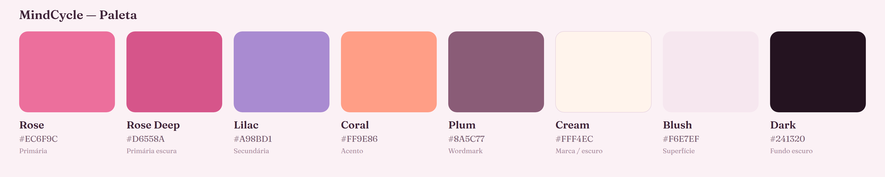

# Paleta de cores — MindCycle

Tons suaves e femininos: rosa como primária, lilás como secundária e coral como acento, sobre neutros quentes.



## Cores da marca

| Amostra | Nome | Papel | HEX | RGB | Uso |
|---|---|---|---|---|---|
| 🟪 | Rose | Primária | `#EC6F9C` | `236, 111, 156` | Cor principal da marca; "Cycle" no wordmark, botões, links |
| 🟪 | Rose Deep | Primária escura | `#D6558A` | `214, 85, 138` | Estados de hover/ativo, ênfase sobre a primária |
| 🟪 | Lilac | Secundária | `#A98BD1` | `169, 139, 209` | Apoio, degradês com a primária, detalhes |
| 🟧 | Coral | Acento | `#FF9E86` | `255, 158, 134` | Detalhe do "sorriso", pontos de destaque |
| 🟫 | Plum | Tinta do wordmark | `#8A5C77` | `138, 92, 119` | Palavra "Mind" no logotipo |
| ⬜ | Cream | Marca em fundo escuro | `#FFF4EC` | `255, 244, 236` | Logo/lua sobre fundos escuros e "cor" |

## Superfícies e neutros

| Amostra | Nome | HEX | RGB | Uso |
|---|---|---|---|---|
| ⬜ | Ground Light | `#FBF1F5` | `251, 241, 245` | Fundo claro padrão |
| ⬜ | Blush | `#F6E7EF` | `246, 231, 239` | Superfície/card suave |
| ⬛ | Ground Dark | `#241320` | `36, 19, 32` | Fundo escuro |
| ⬛ | Ink | `#3E2338` | `62, 35, 56` | Texto principal sobre claro |
| ▪️ | Ink Soft | `#7A5E71` | `122, 94, 113` | Texto secundário |

## Degradê da marca

O degradê principal (usado na lua e no fundo "cor") vai da **Rose** à **Lilac**:

```
linear-gradient(140deg, #EC6F9C 0%, #A98BD1 100%)
```

## Arquivos de token

- `colors.css` — CSS custom properties (`--mc-*`)
- `colors.scss` — variáveis SCSS
- `colors.tokens.json` — design tokens (formato W3C Design Tokens)
- `swatches.svg` / `swatches.png` — amostra visual
